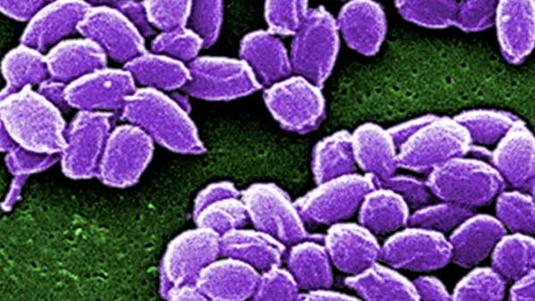

```{r}
#| label: setup
#| include: false

# Loading required libraries
library(tidyverse)
library(ggplot2)
library(lubridate)
library(plotly)

# Load datasets
ecdc_data <- read.csv("ecdc_data.csv")
woah_data <- read.csv("woah_data.csv", sep = ";")

# Data Wrangling 
ecdc_clean <- ecdc_data %>%
  filter(HealthTopic == "Anthrax") %>% 
  select(country = RegionName, 
         year = Time, 
         human_cases = NumValue) %>%
  mutate(country = recode(country, "United Kingdom" = "UK"))

woah_clean <- woah_data %>%
  mutate(eventDate = mdy(eventStartDate), 
         year = year(eventDate)) %>%
  group_by(country, year) %>%
  summarise(animal_outbreaks = n(), .groups = "drop") %>%
  mutate(country = recode(country, "United Kingdom" = "UK"))

combined_data <- full_join(ecdc_clean, woah_clean, by = c("country", "year")) %>%
  mutate(human_cases = replace_na(human_cases, 0), 
         animal_outbreaks = replace_na(animal_outbreaks, 0)) %>%
  filter(year >= 2007) %>%
  filter(!country %in% c("EU", "EU/EEA")) 
```

# Introduction

## Row

### Column

::: {.card title="Background"}


Bacillus anthracis causes the zoonotic disease anthrax. Livestock such as goats, intestinal sheep, and cattle which graze are most commonly infected with anthrax, but humans can get infected from direct contact with infected herds or through exposure to animal products. Although many countries today have very few cases of anthrax in humans, the spores of the disease can remain in soil for more than ten years allowing for the potential of another outbreak many years later. According to CDC anthrax can be difficult to completely eradicate due to the long-term survival of anthrax spores in the environment therefore creating a continuing threat to humans and animals (https://www.cdc.gov/anthrax/index.html). Because of the relationship between human and animal health researchers often take a "One Health" approach when investigating anthrax.

The project studies anthrax distribution throughout Europe using two different data sources. The analysis focuses on three key questions: What proportion of human anthrax cases occurs among the most affected European countries? Which European countries report the highest number of animal anthrax outbreaks? What are the patterns of animal outbreaks in different countries throughout various time periods? This analysis is appropriate for answering the research questions because it combines human disease surveillance data with animal outbreak data, allowing us to examine anthrax from a One Health perspective. Since most human anthrax infections originate from infected livestock or contaminated animal products, comparing these two datasets helps reveal geographic patterns and potential links between animal outbreaks and human cases. The questions provide answers which show disease distribution in different regions and track how animal outbreaks spread to infect humans. The human case data originates from the European Centre for Disease Prevention and Control (ECDC), which provides access to its data through the ECDC Surveillance Atlas (https://atlas.ecdc.europa.eu/public/index.aspx?Instance=GeneralAtlas). The World Organisation for Animal Health (WOAH) provides animal outbreak data through its WAHIS reporting system (https://wahis.woah.org/#/event-management). The combination of these two sources enables us to study how human cases connect with animal outbreaks throughout Europe.

A potential shortcoming of this evaluation is that surveillance systems could under-represent disease transmission, mainly in isolated settings where health care or veterinary systems are not good. For example, an observed zero may indicate that there are very few or no cases, but rather shows poor reporting. In addition, to lessen privacy and equity issues, we examined routine country level data to produce our results and did not identify specific individuals or farms.
:::

# Overview & Context

## Row

### Column {width="50%"}

::: {.card title="Topical Overview"}
Anthrax is a zoonotic disease caused by *Bacillus anthracis*, and human infections often result from contact with infected animals or contaminated animal products. This dashboard explores the critical area where veterinary and human public health interact by analyzing how zoonotic diseases transmit between animal populations and humans throughout Europe.

For more background on the biological and environmental nature of this disease, refer to the [CDC's Anthrax Information Page](https://www.cdc.gov/anthrax/index.html).

By evaluating official records, we aim to answer the following big picture questions:

1.  **What is the proportion of human anthrax cases among the most affected European countries?**
2.  **Which European countries report the highest absolute magnitude of animal anthrax outbreaks?**
3.  **How does the intensity of animal outbreaks vary across different countries and years?**

Examining human case counts alongside animal outbreak data provides insight into possible transmission patterns and cross-sector epidemiological dynamics.
:::

### Column {width="50%"}

::: {.card title="Ethical Considerations & Limitations"}
In reviewing this surveillance data, Fairness and Non-Discrimination must be considered. There is a natural bias in the surveillance information towards areas with a better healthcare infrastructure. The "zero" in the information may not necessarily mean "zero" Anthrax, but rather the absence of testing infrastructure in rural areas. This could result in the underestimation of the health risk posed to marginalized agricultural communities, who are most at risk due to their proximity to livestock.

With regard to Privacy, while the information is aggregate, we must be careful. In a small population, a small number of rare diseases could potentially be traced back to individual farms, singling them out. We are committed to the idea of Safety and Security through the use of only country-level aggregates, so that no individual farms or patients can be identified.
:::

# Data Context

## Row

### Column {width="50%"}

::: {.card title="Data Context: ECDC"}
**Source:** [ECDC Surveillance Atlas](https://atlas.ecdc.europa.eu/public/index.aspx?Instance=GeneralAtlas)

The first data set originates from the European Centre for Disease Prevention and Control. The ECDC is an agency of the European Union aimed at strengthening Europe's defenses against infectious diseases. This source is highly reliable as it is an official EU agency that aggregates data reported by member state public health authorities. It is "real" administrative data used for policy-making and public health monitoring across Europe.

**Sample Details:** The dataset measures confirmed human cases of anthrax across European countries over time. The sample includes reporting years from roughly the early 2000s onward. While highly credible, a shortcoming is potential underreporting, as surveillance quality may vary across countries depending on diagnostic capacity, reporting infrastructure, and public health resources.
:::

### Column {width="50%"}

::: {.card title="Data Context: WOAH"}
**Source:** [WAHIS Event Management](https://wahis.woah.org/#/event-management)

The second source comes from the World Organisation for Animal Health (WOAH). WOAH is the global standard-setting body for animal health. This source of data is "real" veterinary surveillance data that is submitted to an international organization, making it highly credible for reporting zoonotic events.

**Sample Details:** The dataset records the number of reported outbreaks of anthrax in animal populations around the world. It is a transactional dataset, where each row corresponds to a single outbreak report. The sample captures detailed dates and reasons for outbreaks over recent decades. This dataset is very important because Anthrax is basically a disease of herbivores. By monitoring animal outbreaks, we can put the human case information into perspective.
:::

# Q1: Proportional Impact

## Row {height="20%"}

::: {.card title="Question 1: What is the proportion of human anthrax cases among the most affected European countries?"}
To understand how human infections are distributed among the hardest-hit areas, we aggregated the total number of human cases over the entire time period for each country. We then filtered to find the top 5 most affected nations. A pie chart was selected to clearly visualize the proportional share of cases among these top regional hot-spots.

*Note on tools: We utilized `group_by()` and `summarise()` (Basic Tools) to aggregate the data, and `slice_max()` (Basic Tool) to dynamically isolate the top 5 countries. The pie chart was created by generating a stacked bar chart and transforming the axis with `coord_polar()`.*
:::

## Row {height="80%"}

```{r}
#| fig-width: 8
#| fig-height: 8
#| title: "Proportion of Human Cases Among Top 5 Most Affected European Countries"

pie_data <- combined_data %>%
  group_by(country) %>%
  summarise(total_human = sum(human_cases, na.rm = TRUE)) %>%
  slice_max(total_human, n = 5) %>%
  mutate(prop = total_human / sum(total_human) * 100)

plot_ly(
  pie_data,
  labels = ~country,
  values = ~prop,
  type = "pie",
  textinfo = "label+percent",
  hovertemplate = "%{label}<br>Share: %{percent}<br>Cases: %{value:.1f}%<extra></extra>"
) |>
  plotly::layout(
    title = list(
      text = "Proportion of Human Cases Among Top 5 Most Affected European Countries",
      y = 0.95
    ),
    margin = list(t = 80)
  )
```

# Q2: Geographic Magnitude

## Row {height="10%"}

::: {.card title="Question 2: Which European countries report the highest absolute magnitude of animal anthrax outbreaks?"}
To identify the geographic hot zones for veterinary cases, we calculated the total sum of historical animal outbreaks for every country. We filtered out countries that reported zero animal outbreaks to focus exclusively on active regions. We used a standard bar chart sorted in descending order to compare the absolute magnitudes side-by-side.

*Note on tools: We used `filter()` to remove zero-incident countries and `arrange()` (Basic Tool) mentally through `reorder()` to structure the bar chart logically.*
:::

## Row {height="90%"}

```{r}
#| fig-width: 10
#| fig-height: 6
#| title: "Cumulative Animal Anthrax Outbreaks by Country"

bar_data <- combined_data %>%
  group_by(country) %>%
  summarise(total_animal = sum(animal_outbreaks, na.rm = TRUE)) %>%
  filter(total_animal > 0)

p2 <- ggplot(bar_data, aes(x = reorder(country, -total_animal), y = total_animal, fill = country,
                            text = paste("Country:", country, "<br>Outbreaks:", total_animal))) +
  geom_col(color = "black", show.legend = FALSE) +
  scale_fill_viridis_d(option = "mako") +
  labs(
    title = "Cumulative Animal Anthrax Outbreaks by Country",
    x = "Country",
    y = "Total Number of Outbreaks"
  ) +
  theme_minimal(base_size = 14) +
  theme(axis.text.x = element_text(angle = 45, hjust = 1))

ggplotly(p2, tooltip = "text", height = 900)
```

# Q3: Temporal Intensity

## Row {height="20%"}

::: {.card title="Question 3: How does the intensity of animal outbreaks vary across different countries and years?"}
To visualize the intensity of outbreaks across both time and geography simultaneously, we constructed a heat map. First, we filtered the dataset to only include countries that have historically experienced at least one outbreak (removing blank rows). The heat map utilizes color brightness to denote the severity of outbreaks in a specific country during a specific year.

*Note on tools: We utilized the Novel Tool requirement by creating a `geom_tile()` Heatmap. This is a new visualization type not heavily covered in basic ggplot introductions, and it is vastly superior to a standard line graph when trying to look at dozens of countries over a timeline at once without clutter.*
:::

## Row {height="80%"}

```{r}
#| fig-width: 10
#| fig-height: 10
#| title: "Heat Map of Animal Anthrax Outbreaks (2007 - Present)"

heat_data <- combined_data %>%
  group_by(country) %>%
  mutate(country_total = sum(animal_outbreaks, na.rm = TRUE)) %>%
  ungroup() %>%
  filter(country_total > 0) 

p3 <- ggplot(heat_data, aes(x = year, y = country, fill = animal_outbreaks,
                             text = paste("Country:", country, "<br>Year:", year, "<br>Outbreaks:", animal_outbreaks))) +
  geom_tile(color = "white") +
  scale_fill_viridis_c(option = "plasma", name = "Outbreaks") +
  labs(
    title = "Heat Map of Animal Anthrax Outbreaks (2007 - Present)",
    x = "Reporting Year",
    y = "Country"
  ) +
  theme_minimal(base_size = 12)

ggplotly(p3, tooltip = "text", height = 650)
```

# Coding Notes

## Row

::: {.card title="Coding Notes"}
We utilized tools entirely from class activities, lectures, and readings to complete this project, expanding our knowledge via standard R documentation.

**Intermediate / Novel Tools Used:**

1.  **Dates (`lubridate::mdy` and `lubridate::year`):** The WOAH dataset stores dates as character strings. We needed to extract the specific year to successfully join it with the annual ECDC dataset. We learned this from standard documentation to handle string-to-date casting.

2.  **Missing Data Handling (`tidyr::replace_na`):** When executing a `full_join` comparison between human cases and animal outbreaks, missing values (`NA`) were generated for country-years that appeared in one dataset but not the other. We replaced these `NA`s with `0` to correctly reflect that zero cases were reported, preventing errors in mathematical summations.

3.  **New Visualization Type (Heat Map):** We utilized `geom_tile()` combined with a custom color scale to construct a heat map for our third question. This allowed us to map three variables (year, country, and outbreak count) simultaneously in a way that is much cleaner than overlapping a dozen messy line charts.
:::

# Conclusion

## Row

::: {.card title="Key Findings & Conclusion"}
Our analysis shows one more important finding that human anthrax cases occur in only a small number of European nations. After aggregating the human case data and analyzing the proportional distribution we find that a small number of carriers accounted for the vast majority of the statistically observed infections. This means that the risk of being infected with anthrax is not evenly spread throughout Europe but is concentrated within certain areas. This addresses the first objective of our analysis (i.e., to assess the proportion of human anthrax cases which arise in countries most at risk), and demonstrates that there are limited numbers of nations that produce an inordinate proportion of total cases.

The second significant outcome was that anthrax outbreaks in animals occur at a higher frequency and are geographically distributed across a broader area than cases in humans. The animal outbreak dataset compiled by WOAH indicated some countries repeatedly reporting valid livestock outbreaks, providing additional information to answer the second research question regarding the European countries with the most reported livestock anthrax outbreaks. These trends support the theory that anthrax primarily occurs among animal hosts and rarely spills over to human hosts. The geographic distribution of livestock anthrax outbreaks by year allowed us to address the third question about the degree of variability of outbreak frequency by year and therefore provides some evidence to explain that there are large differences in the occurrence of anthrax outbreaks among countries, with some countries having recurring clusters of outbreaks.

Due to the differences among countries in their surveillance systems, it is likely that the analysis has underestimated the actual amount of anthrax activity. It is also possible that countries with a weak veterinary or health system infrastructure will not have detected or reported every case or outbreak, meaning that a reported case of zero may be the result of not being reported rather than the absence of the disease itself. Additional datasets, such as information on livestock populations, vaccination coverage, or environmental risk factors, would assist in improving the analysis in the future. Including these variables would help better understand the reasons for higher levels of outbreaks in certain areas, and could lead to a better understanding of outbreaks in animals and human infections.
:::

# About

## Row

### Column {width="50%"}

::: {.card title="Project Topic & Group Details"}
Our group is interested in the area where veterinary and human public health interact, specifically, we are interested in trying to analyze how zoonotic diseases like Anthrax, transmit between animal populations and humans throughout Europe.

**Partner 1:** Vikaat Ravi

**Partner 2:** Samarth Gupta

**TA:** Sophia Dai

**Lab Section:** INFO 201 BB
:::

### Column {width="50%"}

::: {.card title="Member Info"}
**Vikaat Ravi:**

**Email:** sravi03\@uw.edu

**Interest & Bio:** Vikaat is a CS major at the Allen School at UW with a background in robotics and database management. He is interested in how data engineering can track disease vectors, and that is the reason behind pursuing this project.

**Samarth Gupta:**

**Email:** sammyy18\@uw.edu

**Interest & Bio:** Samarth is a double major in Economics and Real Estate at the University of Washington with a minor in Informatics. He is interested in how data analysis can inform public health policy and economic decision-making, particularly in understanding how disease outbreaks impact markets, resource allocation, and regional development. His interest in combining quantitative analysis with real-world policy applications motivated him to pursue this project.
:::
